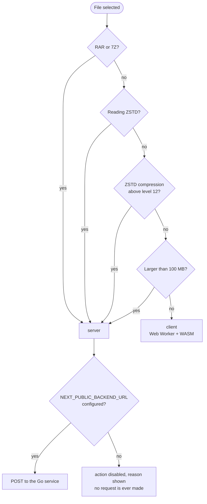
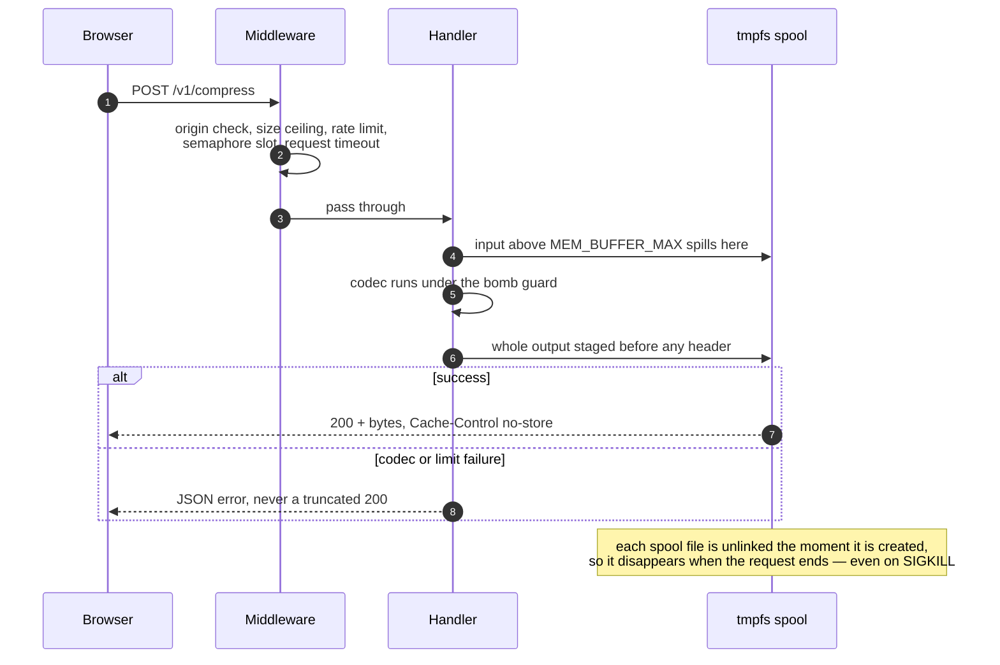

# Toolbox

Utilities for converting, encoding, and compressing data and files, with a
simple interface, browser-first processing, and no accounts or history.

## Features

- **Encoding:** Base64, Base32, and Base58.
- **Formats:** JSON and XML beautify/minify, and joining lines into one.
- **Units:** convert data sizes between bit, byte, KB, MB, GB, and TB, with
  an explicit decimal (1000) or binary (1024) base.
- **Compression:** ZIP, GZIP, ZSTD, and TAR, plus extraction for ZIP, RAR, 7Z,
  GZIP, ZSTD, and TAR.
- **Python escape hatch:** every compression screen hands out a standalone
  Python script that runs the same format and level locally, for the files that
  do not fit in a browser tab.
- **English and Portuguese:** the interface starts in English and can be
  switched from the header. The preference stays only in the browser.
- **Light and dark themes:** follows the system setting until a theme is
  selected.

## Architecture

The product is a browser application. The Go service is an **optional
appendix** to it, not a tier the frontend depends on: with the backend absent,
every text operation and most file operations still work.

```mermaid
flowchart LR
    subgraph browser["Browser — web/"]
        direction TB
        ui["Next.js app<br/>one prerendered route per operation"]
        cat["catalog.ts + i18n.ts<br/>pure metadata: titles, groups, SEO"]
        eng["registry.ts → pure engines<br/>Base64 · Base32 · Base58<br/>JSON · XML · join lines"]
        dec{"decideRouting&#40;&#41;<br/>format · size · level"}
        wk["Web Worker<br/>fflate · zstd-wasm<br/>terminated on exit"]
        note["PrivacyNote<br/>reads result.processedOn"]
        cli["backend.ts<br/>credentials omit<br/>no-store · no-referrer"]

        ui --> cat
        ui -->|text| eng
        ui -->|files| dec
        dec -->|client| wk
        dec -->|server| cli
        dec -.-> note
    end

    subgraph service["Go service — server/ · optional"]
        direction TB
        mw["middleware<br/>CORS · no-store · max bytes<br/>rate limit · semaphore · timeout"]
        hnd["handlers<br/>/v1/compress · /v1/inspect · /v1/extract"]
        arch["archive codecs<br/>sevenzip · rardecode · klauspost"]
        spool["tmpfs spool<br/>unlinked at creation"]
        nodb["no database · no cache · no queue<br/>no session · no history"]

        mw --> hnd --> arch --> spool
        spool -.- nodb
    end

    visitor(["Visitor"]) --> ui
    cli -->|"HTTPS · no cookies"| mw
    spool -->|"bytes, then gone"| cli
```



| Part | Technology | Responsibility |
| --- | --- | --- |
| [`web/`](web/) | Next.js, TypeScript, Web Workers | Interface, text operations, and local file processing |
| [`server/`](server/) | Go 1.25, `sevenzip`, `rardecode`, `klauspost/compress` | The file work the browser cannot do, with size and time limits |
| [`openspec/`](openspec/) | OpenSpec | Requirements: [`specs/`](openspec/specs/) is what the product does today, `changes/` what is in flight |

### The ideas that shape the code

**Catalog and engines are separate.** [`lib/operations/catalog.ts`](web/src/lib/operations/catalog.ts)
is pure data: slug, title, description, group, placeholder. The header, the
home page, and `generateMetadata` read only from it, so listing an operation
never drags its engine into the bundle. [`registry.ts`](web/src/lib/operations/registry.ts)
is where a slug gains execution.

**One prerendered route per operation.** [`app/[operation]/page.tsx`](web/src/app/[operation]/page.tsx)
turns each catalog entry into its own static route with its own title and
description (`generateStaticParams` + `dynamicParams = false`), which is what
makes `/base64` and `/zstd` addressable and indexable instead of tabs in a
single page.

**Engines are pure functions.** An engine takes text and options and returns
text or a typed error. No I/O, no React, no globals — which is why the test
suite is mostly plain function calls.

**Where an operation runs is decided before it runs.**
[`decideRouting()`](web/src/lib/compression/limits.ts) answers `client` or
`server` from explicit rules — never from an exception thrown halfway through.
The same decision feeds both the dispatch and the privacy note under the
screen, so the interface cannot claim "processed in your browser" while
uploading a file.

**Heavy work leaves the main thread and then leaves memory.** Compression runs
in a [Web Worker](web/src/lib/compression/worker.ts) created on demand and
terminated when the screen is left; the WASM module and the user's buffers go
away with it. Codec libraries are dynamic imports, so encoding routes never pay
for a compressor they will not use.

**The backend has no storage layer at all.** No database, cache, or queue
client is imported by the module — what does not exist cannot be used by
mistake. Large inputs and staged output live in a tmpfs spool that unlinks
each file the moment it is created, and `no-store` headers are applied by
middleware rather than per handler.

**Limits are the product, not an afterthought.** Anti-zip-bomb guards
([client](web/src/lib/compression/bomb.ts), [server](server/internal/bomb/guard.go)),
a request-size ceiling, a concurrency semaphore, a per-origin rate limiter, and
a request timeout all exist so a hostile file fails as an HTTP error instead of
as a crash or a truncated `200`.

## Where the backend is used

**Explicitly: only in file compression and extraction, and only under the four
conditions below.** Everything else — all Base64/Base32/Base58 encoding, JSON
and XML beautify/minify, joining lines, format detection, ZIP entry listing,
the generated Python scripts, language, and theme — runs entirely in the
browser and never reaches the network.

The rules live in [`decideRouting()`](web/src/lib/compression/limits.ts) and in
the per-format capability flags in [`formats.ts`](web/src/lib/compression/formats.ts):



| Trigger | Rule | Reason |
| --- | --- | --- |
| **RAR or 7Z** | `clientDecompress: false` | No free browser codec reads these formats |
| **Reading ZSTD** | `clientDecompress: false` | The available WASM library only exposes a synchronous API that allocates the whole output before the anti-bomb limit can be applied |
| **ZSTD compression above level 12** | `NEXT_PUBLIC_ZSTD_CLIENT_MAX_LEVEL` | High levels allocate hundreds of MB, past a tab's budget |
| **Files larger than 100 MB** | `NEXT_PUBLIC_CLIENT_MAX_BYTES` | Above this, the work no longer fits comfortably in the browser |

Everything else stays local: ZIP, GZIP, and TAR in both directions, and ZSTD
compression up to level 12.

The only calls the frontend ever makes to the service are in
[`lib/compression/backend.ts`](web/src/lib/compression/backend.ts):

| Endpoint | Called from | What it does |
| --- | --- | --- |
| `POST /v1/compress` | Compress screen, when routing says `server` | Compresses uploaded files at the chosen format and level |
| `POST /v1/inspect` | Extract screen, when routing says `server` | Lists the entries of an archive |
| `POST /v1/extract` | Extract screen, when routing says `server` | Returns one entry, or the whole payload for single-member formats |
| `GET /healthz` | Ops only | Liveness check |

Requests carry `credentials: "omit"`, `cache: "no-store"`, and
`referrerPolicy: "no-referrer"`. There is no session, no cookie, no user id.

**When `NEXT_PUBLIC_BACKEND_URL` is not set, the backend does not exist for
that installation.** `backendAvailable()` returns `false`, the routing decision
still says `server`, and the interface disables the action and explains why —
it never tries the request and fails. So deploying `web/` alone is a supported
configuration: you lose RAR, 7Z, ZSTD reading, ZSTD above level 12, and files
over 100 MB, and nothing else.

### Anatomy of a server-routed request



### What the backend does not do

It does not serve the site, render pages, hold sessions, store files, keep
history, or cache anything. Temporary files live in the spool for the duration
of one request. See the [deployment guide](server/deploy/README.md) for the
guarantees a deploy must preserve.

## Run locally

### Prerequisites

- Node.js and npm
- Go 1.25.1 or Docker with Docker Compose when using the backend

### 1. Start the optional backend

Open a terminal at the project root:

```bash
cd server
ALLOWED_ORIGINS=http://localhost:3000 go run ./cmd/toolbox-server
```

The server listens on `http://localhost:8080`. During local development, the
spool automatically uses a secure system temporary directory. To choose
another location, set `SPOOL_DIR=/tmp/toolbox-spool`.

With Docker:

```bash
cd server/deploy
docker compose up --build
```

### 2. Start the frontend

In another terminal:

```bash
cd web
npm install
NEXT_PUBLIC_BACKEND_URL=http://localhost:8080 npm run dev
```

Open [http://localhost:3000](http://localhost:3000). Without
`NEXT_PUBLIC_BACKEND_URL`, browser-only tools remain available.

## Validation

Frontend:

```bash
cd web
npm run lint
npm run typecheck
npm test
npm run build
```

Backend:

```bash
cd server
go test ./...
go build ./cmd/toolbox-server
```

## Configuration

The [specification maintenance guide](openspec/README.md) explains how to
validate requirements and consolidate completed changes after integration.

### Frontend (build time)

| Variable | Default | Description |
| --- | --- | --- |
| `NEXT_PUBLIC_BACKEND_URL` | empty | Backend address; empty disables every server-routed operation |
| `NEXT_PUBLIC_CLIENT_MAX_BYTES` | `100 MB` | Above this size, files are routed to the backend |
| `NEXT_PUBLIC_ZSTD_CLIENT_MAX_LEVEL` | `12` | Above this ZSTD level, compression is routed to the backend |
| `NEXT_PUBLIC_MAX_OUTPUT_BYTES` | `2 GB` | Ceiling for the output of a local extraction |
| `NEXT_PUBLIC_MAX_EXPANSION_RATIO` | `500` | Maximum extracted-to-compressed ratio before a payload is treated as a bomb |
| `NEXT_PUBLIC_RATIO_CHECK_FLOOR_BYTES` | `32 MB` | Output size below which the ratio check is not applied |

### Backend

| Variable | Default | Description |
| --- | --- | --- |
| `ADDR` | `:8080` | Listen address |
| `ALLOWED_ORIGINS` | empty | Comma-separated CORS origins |
| `REQUEST_MAX_BYTES` | `512 MB` | Maximum request size |
| `MEM_BUFFER_MAX` | `64 MB` | Maximum content kept in memory |
| `SPOOL_DIR` | `$TMPDIR/toolbox-spool` | Temporary directory for large files and staged output |
| `REQUEST_TIMEOUT` | `120s` | Maximum request duration |
| `MAX_CONCURRENCY` | CPU count (min. 2) | Simultaneous expensive operations |
| `RATE_PER_MINUTE` | `30` | Requests per minute per origin |

For tmpfs capacity, memory sizing, and production operation, see the
[backend deployment guide](server/deploy/README.md).

## License

This project does not declare a license yet.
